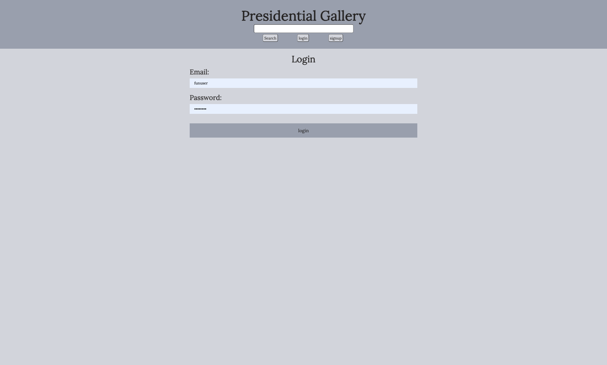
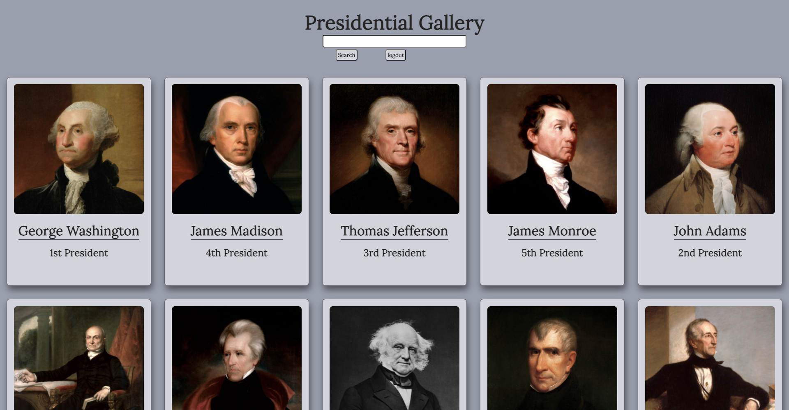

# Presidential Gallery

***

## Table of Contents
- [Description](#description)  
- [Installation](#installation)
- [Usage](#usage)
- [Links](#links)  
- [Visuals](#visuals)
- [Collaborators](#collaborators)
- [Questions](#questions)

***

## Description
This is a full-stack application for a presidential gallery where a user can sign up and login using their chosen email and password. A user who is interested in information about American presidents can visit this application and be presented with interesting details about them. The motivation for this application is a desire to understand facts about previous and current American presidents.

***

## Installation
To install, run this command: `npm i`.

***

## Usage
Begin by running `mysql -u root` to open MySQL database within the terminal. 

Run `source db/schema.sql` while in the root directory. 

Seed the database by running `npm run seeds`. 

Start server by running the `nodemon` command.

***

## Links
[Project Link to GitHub](https://github.com/mattholtmoore/presidential-gallery)  
[Link to Deployment](https://floating-chamber-62136.herokuapp.com/)  

***

## Visuals

***

## Collaborators
Matt: https://www.github.com/mattholtmoore

Simone: https://github.com/simone188535

Jesse: https://github.com/heatedtowel

***

## Questions
If you have any questions at all, please email us at: 

Matt: mattholtmoore@gmail.com

Simone: simone.anthony1@yahoo.com

Jesse: monksjessse@gmail.com

